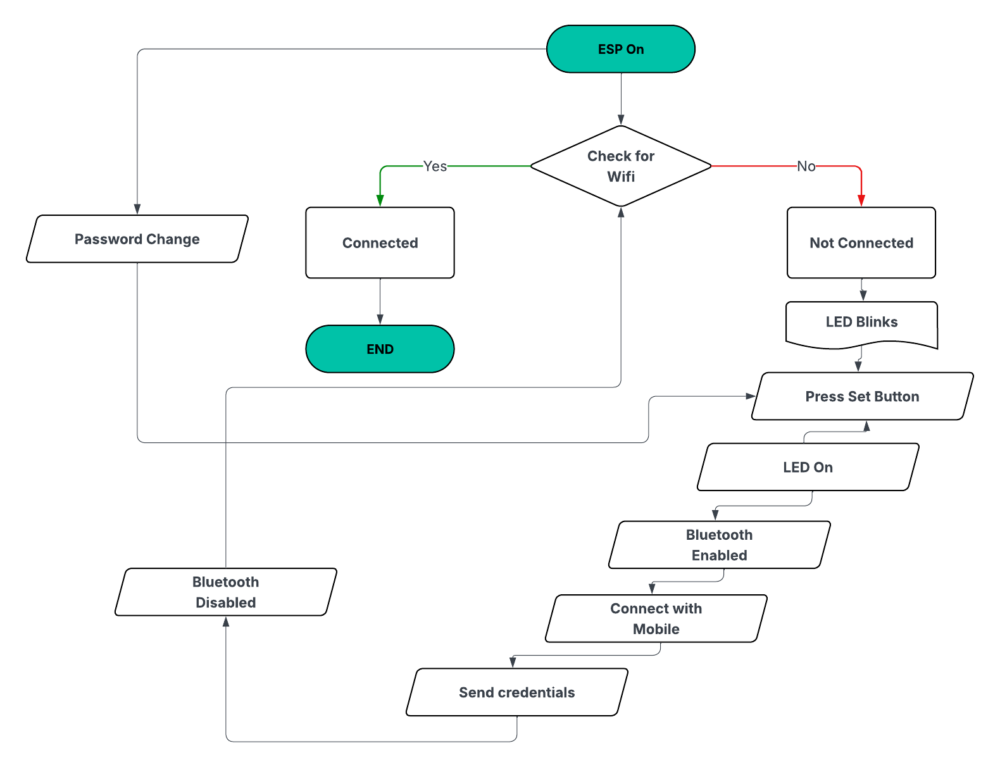

<div align="center">

# EZConnect

**Easy WiFi Configuration for ESP32 via Bluetooth**

[](https://www.arduino.cc/)
[](https://www.espressif.com/)
[](https://opensource.org/licenses/MIT)
[](https://github.com/yourusername/EZConnect)

*Simplify WiFi provisioning with Bluetooth on ESP32 boards*

[Features](#features) • [Installation](#installation) • [Quick Start](#quick-start) • [Documentation](#documentation) • [Examples](#examples)

</div>

---

## About

EZConnect is an easy-to-use Arduino/ESP32 library that simplifies WiFi configuration using Bluetooth. It allows users to send WiFi credentials wirelessly via Bluetooth and automatically connect the ESP32 to WiFi without hardcoding SSID or password. You can use any Bluetooth Serial terminal app or system (Android, iOS, PC, or Mac) to upload the WiFi credentials.

Perfect for IoT projects, smart devices, and first-time WiFi setup systems.

## Features

- **Bluetooth-based WiFi configuration** - No hardcoded credentials
- **Persistent storage** - Stores WiFi credentials using Preferences
- **Auto-reconnection** - Automatically reconnects on reboot
- **Configurable timeout** - Set your own WiFi connection timeout
- **Status LED support** - Visual feedback for connection state
- **Button-triggered setup** - Optional button to enter configuration mode
- **Non-blocking design** - Uses millis() for efficient operation

## Supported Boards

| Platform | Support |
|----------|---------|
| ESP32 (Generic ESP32 Develeopment Boards) | Supported |
| ESP8266 | Not supported (no Bluetooth hardware) |

## Installation

### Method 1: Arduino Library Manager (Recommended)

1. Open Arduino IDE
2. Go to **Sketch** → **Include Library** → **Manage Libraries**
3. Search for **EZConnect**
4. Click **Install**

### Method 2: Manual Installation

1. Download this repository as a ZIP file
2. Open Arduino IDE
3. Go to **Sketch** → **Include Library** → **Add .ZIP Library**
4. Select the downloaded ZIP file

## Quick Start

```cpp
#include <EZConnect.h>

EZConnect ez(2, 0, "EZConnect_BT");
// LED pin = GPIO 2
// Button pin = GPIO 0 (active LOW)
// Bluetooth device name = "EZConnect_BT"

void setup() {
  Serial.begin(115200);

  ez.begin();
  String ssid = ez.getSSID();
  String pass = ez.getPass();

  WiFi.begin(ssid.c_str(), pass.c_str());
  Serial.println("Connecting to " + ssid);

  ez.checkConnectivity(10000, 500, 500);
  // WiFi timeout = 10s, LED on = 500ms, LED off = 500ms
}

void loop() {
  ez.check(); // Check if debug button is pressed
  //Write your rest of the code
}
```

## Bluetooth Credential Format

Send WiFi credentials from any Bluetooth terminal app using one of these formats:

| Format | Example |
|--------|---------|
| **Newline separator** | `MyWiFi\n12345678` |
| **Pipe separator** | `MyWiFi\|12345678` |
| **Tab separator** | `MyWiFi	12345678` |
| **Comma separator** | `MyWiFi,12345678` |

## How It Works



1. ESP32 boots and checks for saved WiFi credentials
2. If credentials exist, ESP32 attempts to connect to WiFi
3. If connection fails, device enters setup mode (LED blinks)
4. Press the button to enable Bluetooth configuration mode
5. User sends WiFi credentials via Bluetooth
6. Credentials are saved internally
7. ESP32 connects to WiFi automatically
8. LED remains ON when WiFi is connected

## Documentation

### Constructor

```cpp
EZConnect(uint8_t ledPin, uint8_t buttonPin, const char* btName);
```

### Parameters

| Parameter | Type | Description |
|-----------|------|-------------|
| `ledPin` | `uint8_t` | GPIO pin for status LED |
| `buttonPin` | `uint8_t` | GPIO pin for setup button (active LOW) |
| `btName` | `const char*` | Bluetooth device name |

### Methods

```cpp
void begin();                    // Initialize EZConnect
String getSSID();                // Get stored WiFi SSID
String getPass();                // Get stored WiFi password
void check();                    // Check button press status
void checkConnectivity(int wifiTimeout, int ledOn, int ledOff);
                                // Check WiFi connectivity with LED feedback
```

## Examples

Check out the [examples](examples/) folder for more detailed use cases:

- [**basic.ino**](examples/basic.ino) - Basic WiFi setup with Bluetooth provisioning

## Project Structure

```
EZConnect/
├── src/
│   ├── EZConnect.h
│   └── EZConnect.cpp
├── examples/
│   └── basic.ino
├── library.properties
├── LICENSE
└── README.md
```

## Contributing

Contributions are welcome! Here's how you can help:

1. Fork the repository
2. Create a feature branch (`git checkout -b feature/AmazingFeature`)
3. Commit your changes (`git commit -m 'Add some AmazingFeature'`)
4. Push to the branch (`git push origin feature/AmazingFeature`)
5. Open a Pull Request

Found a bug? Please [open an issue](https://github.com/Aatiqur/EZConnect/issues).

## License

This project is licensed under the MIT License - see the [LICENSE](LICENSE) file for details.

You are free to use, modify, and distribute this library.

## Author

**Atiqur Rahman**

- Embedded Systems, Robotics, and IoT
- Bangladesh
- 📧 aatiqurrahman111@gmail.com
- 🔗 [LinkedIn](https://www.linkedin.com/in/aatiqurrahman/)

## Support

If you find this project useful, please consider:

- Giving it a star on GitHub
- Reporting bugs and issues
- Suggesting new features
- Contributing to the codebase

---

<div align="center">

**Made with ❤️ for the ESP32 community**

</div>